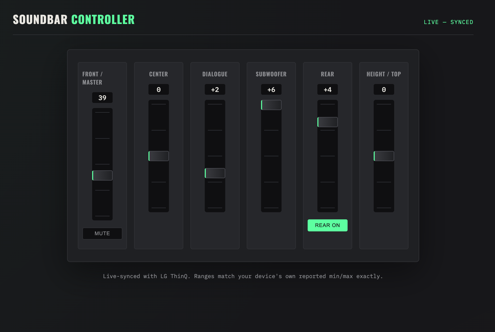
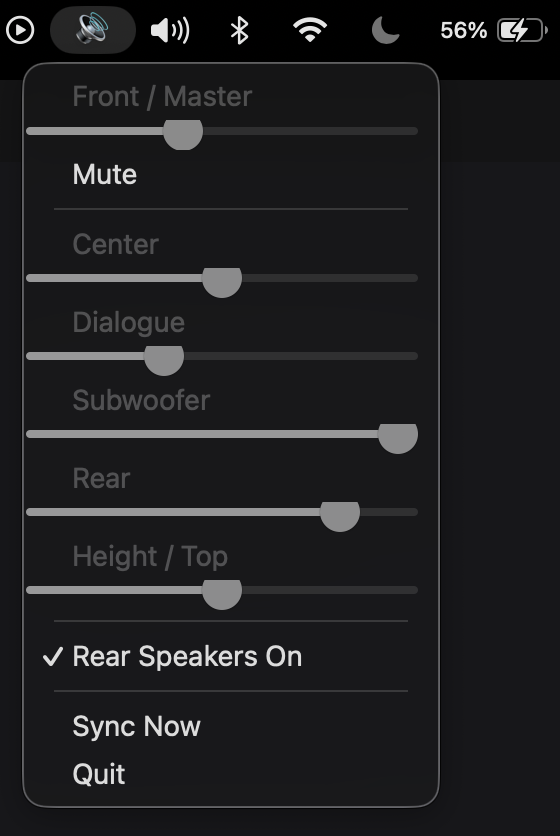

# LG Soundbar Controller

A local, per-channel controller for LG's newer Wi-Fi soundbars (developed and
tested against the **S80TR**, but should work with any model exposing the
same local control protocol on port 9741 — see [Compatibility](#compatibility)).

No cloud account, no ThinQ login, no internet dependency. This talks
directly to your soundbar over your LAN, live-synced with the official LG ThinQ app meaning a change in levels in either place updates the other instantly.

Two ways to use it:

- **A local web controller** — a mixing-console-style page in your browser with
  a slider per channel.
- **A native macOS menu bar app** — the same controls live in your menu
  bar, no browser needed.

## Features

- Independent control of **Front/Master, Center, Dialogue, Subwoofer,
  Rear, and Height/Top** channels
- Live two-way sync with the LG ThinQ app (uses the same local protocol
  ThinQ itself uses)
- Slider ranges match your device's *actual* reported min/max for each
  channel
- Mute and rear-speaker on/off toggles

## How it works

LG's newer soundbars run a local control service on TCP port 9741, using
AES-encrypted JSON messages. This is the same channel the official ThinQ
app uses when it's on the same network as the soundbar. `lg_soundbar.py`
implements that protocol from scratch (informed by the prior reverse
engineering in [google/python-temescal](https://github.com/google/python-temescal),
credited below); `server.py` and `menubar_app.py` are two different
front ends built on top of it.

## Requirements

- Python 3.9+
- A Mac (or any machine) on the same local network as the soundbar. (The
  soundbar can't be on a separate guest/IoT Wi-Fi network from whatever
  runs this)

## Setup

```bash
git clone https://github.com/panshul-khanna/lg-soundbar-controller.git
cd lg-soundbar-controller
pip3 install -r requirements.txt
```

### Find your soundbar's IP

The soundbar needs to already be set up on your Wi-Fi via the LG ThinQ
app. To find its IP:

- Scan your LAN for the port this project uses:
  ```bash
  # find your own subnet first
  ipconfig getifaddr en0
  # then scan it (replace with your actual subnet)
  brew install nmap   # if you don't have it
  sudo nmap -p 9741 --open 192.168.1.0/24
  ```
  Whichever IP shows `9741/tcp open` is almost certainly the soundbar, essentially nothing else runs a service on that port.
- You can also use the LG ThinQ app itself or the Google Home app if the soundbar has Cast built in to get the IP.

### Option A: Web controller

```bash
python3 server.py 192.168.1.42   # replace with your soundbar's IP
```

Open **http://localhost:8765**.



### Option B: macOS menu bar app

```bash
python3 menubar_app.py 192.168.1.42
```


A speaker icon (🔊) appears in your menu bar. The IP is saved to
`~/.lg_soundbar_controller.json` after the first run, so subsequent runs
don't need the argument.

#### Running the menu bar app without a terminal

See [`launchd/com.local.lgsoundbar.menubar.plist.example`](launchd/com.local.lgsoundbar.menubar.plist.example)
for a `launchd` template that starts it automatically at login. Copy it,
fill in your actual paths and Python interpreter, then:

```bash
cp launchd/com.local.lgsoundbar.menubar.plist.example ~/Library/LaunchAgents/com.local.lgsoundbar.menubar.plist
# edit the paths inside first!
launchctl load ~/Library/LaunchAgents/com.local.lgsoundbar.menubar.plist
```

### Debugging a connection

`diagnose.py` is a bare-bones, dependency-light script that connects to
the soundbar and prints exactly what happens at each step of the
protocol handshake — useful if `server.py`/`menubar_app.py` can't connect
and you want to see the raw exchange:

```bash
python3 diagnose.py 192.168.1.42
```

## Project structure

```
lg-soundbar-controller/
├── lg_soundbar.py       # protocol client (socket + AES encryption)
├── server.py            # Flask backend + web controller
├── menubar_app.py       # native macOS menu bar app (rumps)
├── diagnose.py          # standalone connection debugger
├── templates/
│   └── index.html       # web controller UI
├── launchd/
│   └── *.plist.example  # template for running the menu bar app at login
└── requirements.txt
```

## Compatibility

Confirmed working on the **LG S80TR**. The protocol (port 9741, AES-CBC
with a fixed key) is shared across LG's recent Wi-Fi soundbar line, so
other models (S90TR, S95AR, SP-series, etc.) likely work too, though
field names for some settings may differ slightly. If you get it working
on another model, a PR noting compatibility (or adding new fields) is
welcome.

## Disclaimer

This is an independent, unofficial project. It is not affiliated with,
endorsed by, or supported by LG Electronics. This was built by reading the soundbar's own local network protocol, not from
any official documentation.

## Acknowledgments

- [google/python-temescal](https://github.com/google/python-temescal) —
  prior reverse engineering of LG's speaker control protocol that this
  project's approach was informed by and verified against.

## License

MIT — see [LICENSE](LICENSE).
